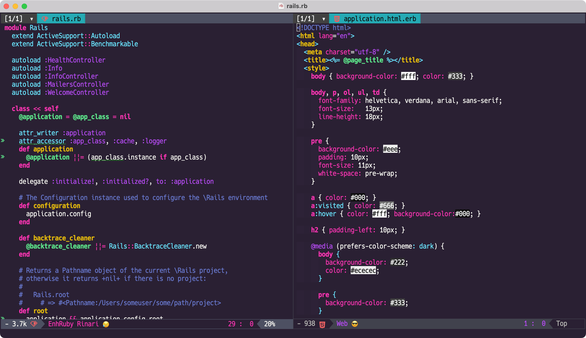

# Kabukichō Theme for [Emacs](https://www.gnu.org/software/emacs/)

> A dark theme for [Emacs](https://www.gnu.org/software/emacs/)
> 
> The code is based on [emacs/dracula](https://github.com/dracula/emacs)  
> The theme is based on [victoriadrake/kabukicho-vscode](https://github.com/victoriadrake/kabukicho-vscode), merged with [webrender/synthwave-x-fluoromachine](https://github.com/webrender/synthwave-x-fluoromachine)



Font in the screenshot is [HackGen](https://github.com/yuru7/HackGen)

## Install

### Install using straight.el

To load a theme add the following to your init.el

    (straight-use-package
     '(emacs-kabukicho-theme
       :type git :host github :repo "mitukiii/emacs-kabukicho-theme"))
    (load-theme 'kabukicho t)

### Install manually

Add the emacs theme files to `~/.emacs.d/themes`.  
To load a theme add the following to your init.el

    (add-to-list 'custom-theme-load-path "~/.emacs.d/themes")
    (load-theme 'kabukicho t)

## Configure

Some aspects of this theme are customizable.  
You can change them either by doing `M-x customize-group kabukicho ` or setting one or more of the following values in your Emacs init file.  
Note that these variables need to be set before `load-theme` is invoked for Kabukicho.

```
;; Don't change the font size for some headings and titles (default t)
(setq kabukicho-enlarge-headings nil)

;; Adjust font size of titles level 1 (default 1.3)
(setq kabukicho-height-title-1 1.25)

;; Adjust font size of titles level 2 (default 1.1)
(setq kabukicho-height-title-1 1.15)

;; Adjust font size of titles level 3 (default 1.0)
(setq kabukicho-height-title-1 1.05)

;; Adjust font size of document titles (default 1.44)
(setq kabukicho-height-doc-title 1.4)

;; Use less pink and bold on the mode-line and minibuffer (default nil)
(setq kabukicho-alternate-mode-line-and-minibuffer t)
```

## License

[MIT License](./LICENSE)
